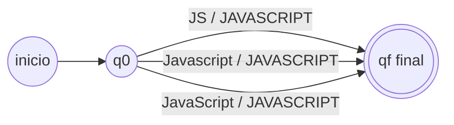

# Punto 2 — Vista previa mínima de normalización

Esta vista previa conecta el extractor del punto 1 con un transductor finito de `pyformlang`. Solo normaliza tres formas literales de JavaScript (`JS`, `Javascript`, `JavaScript`) al símbolo `JAVASCRIPT`. Las cualificaciones que el transductor no conoce se conservan como estaban. No representa la normalización completa de la consigna.

## Modelo formal

El transductor de demostración se define como el 7-tuplo:

```text
M = (Q, Σ, Γ, δ, ω, q0, F)
Q = {q0, qf}
Σ = {JS, Javascript, JavaScript}
Γ = {JAVASCRIPT}
δ = {(q0, x, qf) | x ∈ Σ}
ω = {(q0, x, qf, [JAVASCRIPT]) | x ∈ Σ}
q0 = q0
F = {qf}
```

En este pequeño modelo cada cualificación extraída se trata como un símbolo de entrada. Así se prueba el encadenamiento entre etapas; un modelo más amplio deberá decidir y documentar cómo se tokenizan las cualificaciones de todos los grupos requeridos.



## Ejecución

La dependencia se mantiene opcional para que el punto 1 siga sin dependencias de ejecución:

```powershell
python -m pip install -e ".[stage2-preview]"
python -c "from resumelens.normalization_preview import normalize_resume_skills; print(normalize_resume_skills('Skills: JS, Python'))"
```

La implementación está en `src/resumelens/normalization_preview.py`. La prueba `tests/test_normalization_preview.py` verifica el flujo extracción → transductor. La suite la omite con una explicación si el extra opcional no está instalado.
