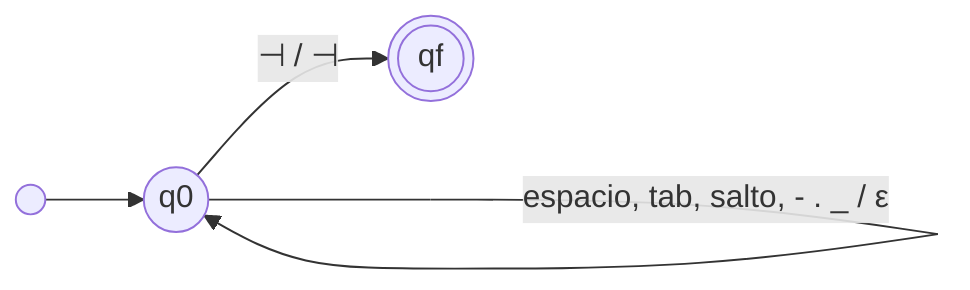
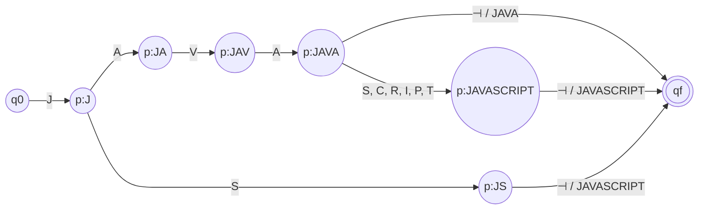
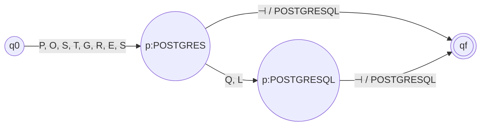

# Punto 2 — Normalización con transductores finitos

Esta etapa convierte las menciones literales del punto 1 (`JS`, `React.js`, `scikit learn`, `Machine-learning model development`…) en **tokens canónicos** (`JAVASCRIPT`, `REACT`, `SCIKIT_LEARN`, `ML_MODEL_DEVELOPMENT`…). Sustituye a la vista previa `stage-2-normalization-preview.md`, que modelaba cada alias como un único símbolo; aquí la unidad de entrada es el **carácter**.

## Alcance

- **Entrada:** el `value` de cada coincidencia de `skills` y `other_qualifications` (46 tokens posibles; ver `normalization/catalog.py`). Contactos, grados y años de experiencia no tienen equivalencias que normalizar y quedan fuera.
- **Salida:** tokens canónicos sin duplicados, valores no reconocidos y, si se indica un perfil, los tokens en el orden canónico del perfil.
- **Cadena:** `valor → T1 (limpieza) → T2 (alias → token) → deduplicar → ordenar por perfil`. Solo T1 y T2 son transductores; deduplicar y ordenar son lógica de aplicación (`pipeline.py`, `profiles.py`).

## Decisiones de diseño

1. **Tokenización por carácter.** Los estados de T2 representan prefijos ya leídos, no un diccionario disfrazado.
2. **Marcador de fin `⊣`.** Varios alias son prefijo de otros (`Java`/`JavaScript`, `SQL`/`SQLite`/`SQL Server`, `React`/`ReactJS`). Se añade `⊣` a Σ y la salida se emite solo al consumirlo; así la traducción depende de la cadena completa y no de un prefijo.
3. **Dos transductores.** T1 absorbe las variaciones de mayúsculas, espacios y separadores (`React.js`, `ReactJS` y `react js` convergen en `REACTJS`), lo que mantiene T2 pequeño.
4. **Rechazo explícito.** Una cadena fuera del modelo no tiene traducción: el valor va a `unrecognized` y no llega a la etapa 3.
5. **Catálogo como única fuente de verdad.** T2 se genera desde `CATALOG`; un alias ambiguo lanza `ValueError` al construirlo.
6. **δ y ω en pyformlang.** La librería guarda la salida en la transición, de modo que δ y ω se implementan como una sola función `Q × Σ → Q × Γ*`. En la 7-tupla, ω es su proyección sobre la salida.

## T1 — Transductor de limpieza

```text
M1 = (Q, Σ, Γ, δ, ω, q0, F)
Q  = {q0, qf}
Σ  = {A..Z, a..z, +, #, ' ', \t, \r, \n, '-', '.', '_', ⊣}
Γ  = {A..Z, +, #, ⊣}
δ  = {(q0, x, q0) | x ∈ letras ∪ {+, #} ∪ separadores} ∪ {(q0, ⊣, qf)}
ω  = {(q0, a, q0) ↦ A | a ∈ {a, A}, para cada letra}      # a mayúscula
   ∪ {(q0, x, q0) ↦ x | x ∈ {+, #}}                        # se conservan
   ∪ {(q0, s, q0) ↦ ε | s ∈ separadores}                   # se eliminan
   ∪ {(q0, ⊣, qf) ↦ ⊣}
q0 = q0
F  = {qf}
```



Ejemplo: `Scikit-learn⊣` → `SCIKITLEARN⊣`; `Spring \n Boot⊣` → `SPRINGBOOT⊣`.

## T2 — Transductor de alias a token canónico

Se construye como un *trie* sobre las claves limpias (alias del catálogo pasados por T1). Con el catálogo actual tiene **359 estados y 419 transiciones**, demasiado para dibujar completo; la definición es genérica y los diagramas se muestran por familia.

```text
M2 = (Q, Σ, Γ, δ, ω, q0, F)
K  = {clean(alias) | alias ∈ CATALOG}  con clean = T1 sin ⊣        # claves
Q  = {q0, qf} ∪ {p_w | w prefijo propio no vacío de alguna k ∈ K} ∪ {p_k | k ∈ K}
Σ  = {A..Z, +, #, ⊣}
Γ  = {los 46 tokens canónicos}
δ  = {(p_w, c, p_wc) | wc prefijo de alguna k ∈ K}  (con p_ε = q0)
   ∪ {(p_k, ⊣, qf) | k ∈ K}
ω  = {(p_w, c, p_wc) ↦ ε}  ∪  {(p_k, ⊣, qf) ↦ token(k)}
q0 = q0
F  = {qf}
```

Fragmento para `JAVA` / `JAVASCRIPT` / `JS` (el prefijo común no interfiere gracias a `⊣`):



Fragmento para `POSTGRES` / `POSTGRESQL`:



## Orden canónico por perfil

`profiles.py` define para cada perfil una lista de grupos ordenados; los tokens se ordenan por (grupo, posición en el grupo). Los tokens que el perfil no contempla se devuelven aparte en `outside_profile` y no se envían al autómata. Así `Git, NodeJS, JS, Postgres, React.js` produce `JAVASCRIPT, REACT, NODE_JS, POSTGRESQL, GIT`, igual que en la consigna.

| Perfil | Orden de grupos |
| --- | --- |
| Full Stack | frontend (lenguaje, framework) → backend → API → base de datos → control de versiones |
| Machine Learning | Python → Pandas/NumPy → Scikit-learn/TensorFlow/PyTorch → desarrollo de modelos ML → SQL/PostgreSQL → Git |

Los dos perfiles propios del equipo se añaden como nuevas entradas de `PROFILES`, y sus tecnologías como entradas de `CATALOG` (y de `patterns.py`, si la etapa 1 aún no las detecta).

## Ejecución y pruebas

```powershell
python -m pip install -e .
python -m resumelens .\resume.txt --normalize --profile full_stack
python -m unittest discover -s tests -v
```

`tests/test_normalization.py` cubre: los ejemplos de la consigna, todos los alias del catálogo, mayúsculas y espacios, prefijos, `C++`/`C#`, rechazo de valores desconocidos, equivalencia de T1 con la limpieza en Python puro, deduplicación, independencia del orden de entrada y que **todo valor del dataset de la etapa 1 se normalice**.

## Limitaciones

- Σ de T1 es ASCII; un carácter fuera de Σ (por ejemplo un dígito) hace que el valor se rechace.
- `SQL Server` produce dos menciones en la etapa 1 (`SQL` y `SQL Server`), y la etapa 2 las normaliza a `SQL` y `SQL_SERVER`. Decidir si cuentan como `SQL` corresponde a la etapa 3 (o a corregir el patrón de la etapa 1).
- El orden por perfil asume un token por grupo; si un CV trae `Pandas` y `NumPy`, ambos aparecen consecutivos y el autómata debe admitirlo.
- El catálogo es cerrado: una tecnología no listada se reporta como no reconocida.